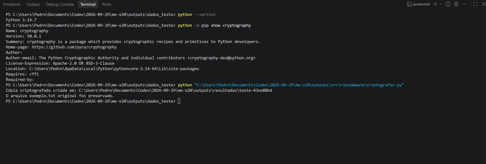
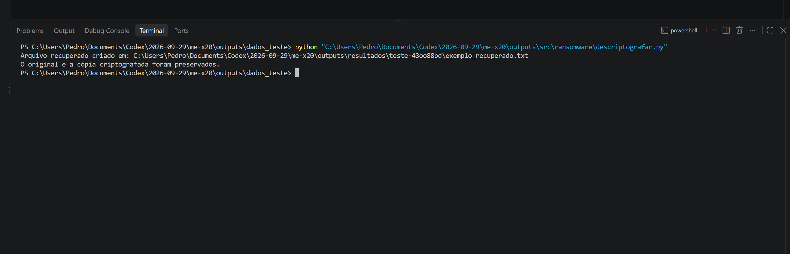
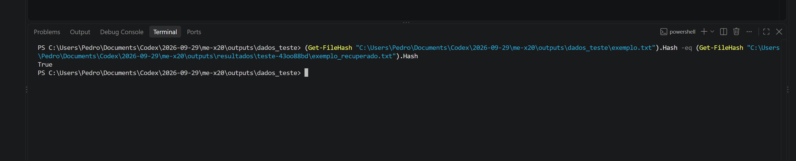
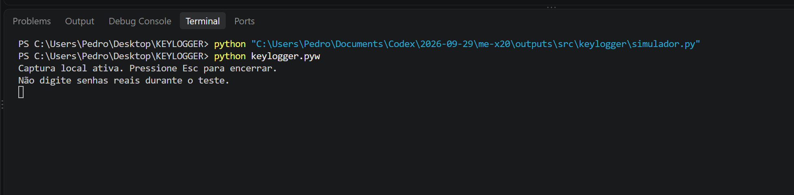
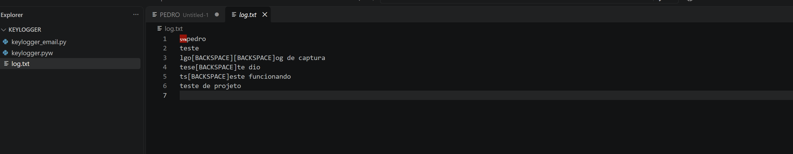
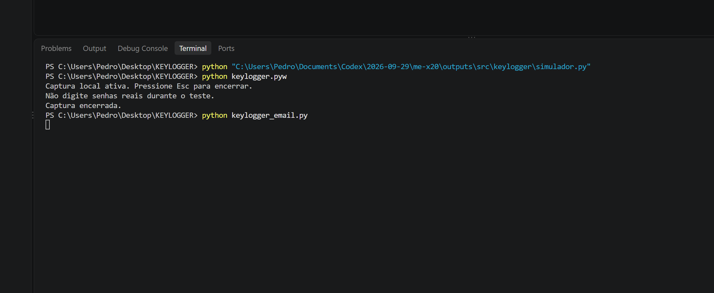
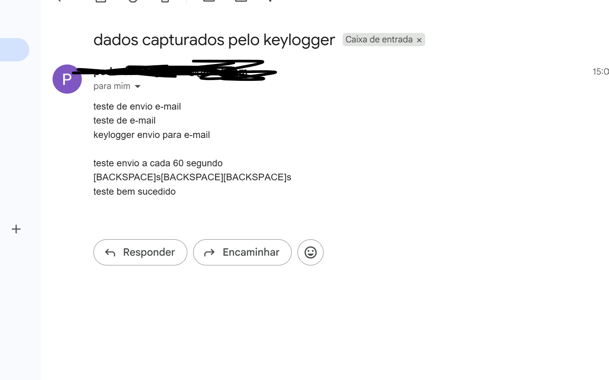

# Experimentos: criptografia, registro local e evidência de e-mail

O experimento de criptografia e recuperação foi executado com um arquivo fictício. A comparação dos hashes SHA-256 do original e do arquivo recuperado retornou `True`. Os registros locais e o recebimento de uma mensagem por e-mail foram documentados a partir das capturas fornecidas pelo usuário.

## Ambiente observado

- Sistema: Windows, com terminal PowerShell integrado ao VS Code.
- Python: versão 3.14.7, conforme saída apresentada no terminal.
- Biblioteca `cryptography`: versão 50.0.1.
- Dados: um arquivo de texto fictício criado manualmente no VS Code.

Não foi comprovado o uso de máquina virtual ou sandbox. O script de criptografia utilizado aponta para um único arquivo de teste e não percorre diretórios. Essa limitação de escopo não equivale ao isolamento fornecido por uma sandbox.

## Experimento 1 — Criptografia e recuperação

### Objetivo

Observar a criptografia de uma cópia de um arquivo fictício e sua recuperação com a chave correspondente, preservando o original e verificando a integridade do conteúdo recuperado.

### Entrada utilizada

O arquivo `dados_teste/exemplo.txt` foi criado manualmente no VS Code, com o seguinte texto:

```text
Este arquivo contém apenas dados fictícios.
Foi criado para um exercício de segurança em Python.
Teste número 001.
```

### Procedimento realizado

1. Verificar a versão do Python com `python --version`.
2. Verificar a biblioteca com `python -m pip show cryptography`.
3. Executar `src/ransomware/criptografar.py`.
4. Conferir a criação de `chave.key` e `exemplo.txt.fernet` na pasta exclusiva da execução.
5. Abrir o arquivo original e confirmar que seu texto continuava legível.
6. Executar `src/ransomware/descriptografar.py`.
7. Comparar os hashes SHA-256 do original e do arquivo recuperado com `Get-FileHash`, no PowerShell.
8. Salvar as capturas de tela das execuções e da comparação.

Os scripts foram chamados pelo caminho absoluto no terminal. Os caminhos relativos deste documento partem da raiz do projeto, que contém `src`, `dados_teste` e `resultados`.

### Funcionamento do código utilizado

O script de criptografia utiliza Fernet e lê somente o arquivo fictício configurado. Cada execução cria uma nova pasta de resultados, grava uma nova chave e produz uma cópia criptografada. O original não é sobrescrito.

O script de recuperação lê a chave e a cópia criptografada da execução selecionada. O conteúdo recuperado é salvo em um novo arquivo. Se esse arquivo já existir, o script interrompe a operação sem sobrescrevê-lo.

Os caminhos estão configurados para a máquina utilizada no teste. A reprodução em outra máquina exige ajustá-los. O script de recuperação também deve apontar para a pasta da execução que será recuperada.

### Arquivos produzidos

```text
resultados/
└── teste-43oo88bd/
    ├── chave.key
    ├── exemplo.txt.fernet
    └── exemplo_recuperado.txt
```

A chave é um artefato local de recuperação e não deve ser publicada. Guardá-la ao lado da cópia criptografada atende à demonstração didática; não representa uma estratégia de proteção de chaves para dados reais.

### Verificação de integridade

Foi comparado o hash SHA-256 de `dados_teste/exemplo.txt` com o de `resultados/teste-43oo88bd/exemplo_recuperado.txt`. O comando retornou:

```text
True
```

Isso demonstra que os hashes dos dois arquivos coincidiram nessa verificação e sustenta a conclusão de que o conteúdo foi recuperado corretamente. A comparação foi realizada após a recuperação; não foi registrado um hash anterior à criptografia. A preservação do original também foi conferida visualmente pelo usuário.

### Resultado observado

A cópia criptografada foi criada e recuperada com sucesso. O texto original permaneceu legível e a comparação de integridade retornou `True`.

O exercício demonstra criptografia e recuperação de uma cópia. Não houve bloqueio do original, cobrança de resgate ou geração de mensagem de resgate pelo código utilizado.

### Evidências

**1. Execução da criptografia:** versões do ambiente, comando executado e mensagem de criação da cópia.



**2. Execução da recuperação:** comando executado e mensagem de criação do arquivo recuperado.



**3. Comparação de integridade:** comando de comparação dos hashes SHA-256 e resultado `True`.



## Experimento 2 — Registro local de teclado

**Situação:** o usuário apresentou capturas da execução de `keylogger.pyw`, do conteúdo de `log.txt` e, posteriormente, da mensagem “Captura encerrada.”.

O código compartilhado utiliza um listener global de teclado do `pynput`. Portanto, a captura não fica restrita ao editor, ao terminal ou a uma janela do exercício. O termo “local” descreve onde o registro é gravado, não uma limitação do alcance da captura.

O log apresentado contém frases de teste, quebras de linha e marcações `[BACKSPACE]`. Essas marcações representam eventos de tecla e não a edição retroativa do texto já registrado. Assim, o registro não equivale necessariamente ao texto final exibido na aplicação.

### Evidências





A captura seguinte mostra a mensagem de encerramento da versão local e a chamada da versão de e-mail. O encerramento exibido refere-se à versão local; não comprova que a versão de e-mail foi encerrada.



Não foi apresentado um teste posterior para verificar a ausência de novos registros após o encerramento. O simulador com campo de entrada próprio não foi a implementação escolhida pelo usuário para essas evidências.

## Experimento 3 — Evidência de recebimento por e-mail

**Situação:** o usuário relatou executar o teste por conta própria e apresentou uma mensagem na caixa de entrada, com assunto “dados capturados pelo keylogger” e conteúdo de teste.

A captura mostra frases de teste e marcações de teclas. Os dados de identificação do remetente foram ocultados na imagem fornecida. A evidência documenta a mensagem recebida apresentada pelo usuário, mas não permite verificar independentemente toda a cadeia de captura e transmissão.



### Alcance da evidência

- A imagem mostra uma mensagem na caixa de entrada com o assunto e o conteúdo descritos.
- A captura do terminal mostra a chamada de `keylogger_email.py`.
- O trecho de código compartilhado prevê agendamento de envio com intervalo de 60 segundos. Uma única mensagem não comprova a periodicidade real nem a continuidade dos envios.
- Não foram apresentados cabeçalhos completos, registros de entrega ou evidência do encerramento dessa versão.
- O texto “teste bem sucedido” no corpo da mensagem é conteúdo digitado; não é um resultado gerado por uma ferramenta de validação.

Esta seção registra os resultados enviados pelo usuário. Não contém instruções de configuração de credenciais ou de operação do envio de entradas capturadas.

## Riscos e reflexão defensiva

O listener global pode alcançar informações digitadas fora do exercício. A transmissão de registros por e-mail cria cópias em outros sistemas e aumenta a exposição de dados. Consentimento, escopo e minimização da coleta são pontos centrais da análise.

Uma extensão de arquivo ou uma captura de tela não demonstra furtividade ou evasão. Essas propriedades não foram validadas. O uso de credenciais no código também exige cuidado para evitar sua publicação; nenhuma credencial é necessária para documentar as evidências.

## Resumo dos resultados

| Verificação | Estado e evidência |
|---|---|
| Versões do Python e da biblioteca de criptografia | Registradas no terminal; captura 01 |
| Criação da cópia criptografada | Executada; captura 01 |
| Original legível após a criptografia | Conferido visualmente pelo usuário |
| Recuperação da cópia | Executada; captura 02 |
| Comparação dos hashes SHA-256 | Resultado `True`; captura 03 |
| Registro local de teclado | Execução e log apresentados; capturas 04 e 05 |
| Mensagem de encerramento da versão local | Visível; captura 06 |
| Mensagem na caixa de entrada | Apresentada pelo usuário; captura 07 |
| Intervalo real entre envios | Não verificado |
| Encerramento da versão de e-mail | Não demonstrado |
| Captura restrita a uma janela | Não corresponde ao listener global utilizado |
| Mensagem de resgate | Não gerada pelo código de criptografia utilizado |

## Limitações e aprendizado

A criptografia foi testada com um único arquivo fictício. Não foram testados chave incorreta, dados adulterados, falhas de permissão ou múltiplos arquivos. Não há demonstração de isolamento por sandbox, avaliação de antivírus ou firewall, nem resultados de testes automatizados.

Os experimentos de teclado foram documentados a partir dos códigos compartilhados e das capturas fornecidas pelo usuário. A correspondência exata entre os trechos compartilhados e os arquivos executados não foi auditada. A versão instalada de `pynput` não foi informada.

A recuperação destaca a importância de conservar a chave correta e verificar a integridade. O registro de teclado e a mensagem apresentada ilustram o risco de exposição das entradas. As evidências têm alcances distintos: uma comparação de hashes verifica uma propriedade dos arquivos, enquanto uma captura da caixa de entrada mostra uma mensagem recebida sem validar todo o comportamento do programa.
